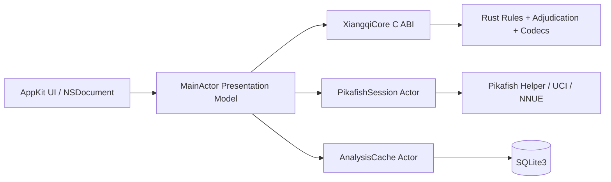

# 02. 系统架构

## 1. 总体结构



依赖单向。Rust 不依赖 Swift；Pikafish 不依赖 UI；缓存不决定文档状态。UI 可从 Rust 规范状态重建。

## 2. 模块

- `App/NativeXiangqi`：应用入口、文档类型、资源、entitlements、release scheme。
- `Packages/XiangqiUI`：棋盘、变化树、分析器、判罚说明和 AppKit 控制器。
- `Packages/XiangqiDocumentKit`：`NSDocument`、`.xqgame` 读写、迁移、FEN/UCCI 面板。
- `Packages/PikafishKit`：helper 生命周期、UCI parser/state machine、类型化结果。
- `Packages/XiangqiCoreBinary`：生成 C header、静态 artifact、Swift 窄封装。
- `Rust/crates/xiangqi-core`：规范棋局、规则、变化树、hash、repetition/adjudication。
- `Rust/crates/xiangqi-io`：`.xqgame` core payload、FEN/UCCI。
- `Rust/crates/xiangqi-ffi`：唯一 C ABI/unsafe。
- `Engines/Pikafish/corresponding-source`：精确发布源码/patch/build metadata。

`XiangqiUI` 不解析原始 UCI；`PikafishKit` 不访问 AppKit；Rust 不启动进程或访问 UI。

## 3. 状态所有权

### 3.1 Rust 规范状态

`GameHandle`：

- 90-square board；
- side to move；
- variation tree/current node；
- captures/counters；
- position and repetition hashes；
- per-ply event history；
- explicit rule profile/version；
- adjudication state；
- bounded annotations/extensions。

Swift `XiangqiSnapshot`：

- 90 格 piece codes；
- side、move number、last move；
- selected/legal destinations；
- check/mate/stalemate summary；
- adjudication summary ID；
- current node摘要。

Swift 不保存独立合法着或判罚历史。

### 3.2 展示状态

`@MainActor` 持有 hover/selection、board flip、coordinate style、panel visibility、candidate list、clock display 和 preview PV。board flip 只做视图 transform。

### 3.3 引擎状态

每个文档轻量 controller，App 默认一个 heavy `PikafishSession`。局面变化：

1. generation 增加；
2. `stop` 当前搜索；
3. 清 partial UI；
4. cache lookup；
5. `position fen ... moves ...`；
6. 发起 `go`；
7. 丢弃旧 generation 输出。

## 4. 并发

- `MainActor`：AppKit、文档协调、展示模型。
- `PikafishSession actor`：Process、pipes、UCI state、pending search、deadline、restart。
- `AnalysisCache actor`：SQLite。
- 大文档 parse/migrate/serialize：后台 Rust，完成后原子替换。
- WXF adjudication为确定性 Rust 操作；若判例分析昂贵，批量报告在后台，但单步应用仍有界。

禁止可变全局单例。引擎 manager 不持有文档规范内容。

## 5. helper 生命周期

```text
stopped -> launching -> uciHandshake -> ready -> searching
searching -> stopping -> ready
ready/searching -> failed
failed -> stopped -> launching (explicit retry)
ready -> idleTimeout -> stopping -> stopped
```

handshake：

```text
uci
parse id/options
uciok
set advertised whitelist options
isready
readyok
```

切换棋局：`stop` → bounded terminal → `ucinewgame` → `isready` → `position`。关闭：`stop` → `quit` → timeout fallback terminate。

## 6. 数据流

### 落子

```text
input
 -> geometry square
 -> Rust selectable/legal query
 -> Rust apply
 -> snapshot + undo token + events
 -> UndoManager
 -> minimal redraw
 -> cancel/generation
 -> optional analysis
```

### 打开

```text
NSDocument read
 -> bytes/version/size check
 -> background parse/migrate into new Rust handle
 -> invariant/hash validation
 -> MainActor atomic install
 -> failure preserves source and old state
```

### 分析

```text
canonical position + required history + rule profile +
engine commit + NNUE hash + preset/budget
 -> cache
 -> UCI position/go
 -> typed throttled info
 -> terminal bestmove
 -> Rust legality validation
 -> final cache
```

### 判罚

```text
apply move
 -> emit per-ply rule events
 -> repetition cycle detector
 -> profile-specific responsibility classifier
 -> structured result + explanation
 -> UI badge/panel
```

## 7. 失败边界

- Rust legality error：拒绝，不变更。
- ambiguous WXF：明确 unsupported，不猜测。
- document parse/migration error：不覆盖。
- helper/NNUE/hash error：禁用分析，文档可用。
- illegal bestmove：停止 session，保存受限诊断，不自动替代。
- UCI 超长/乱码/flood：终止会话。
- cache corruption：隔离重建。
- release policy violation：构建/打包失败，而非 warning。
